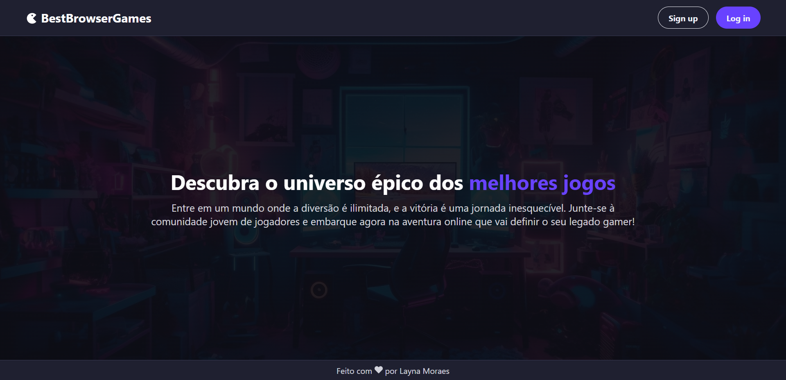

<h1 align="center"> 🎮 BestBrowserGames </h1>

  <a href="#-tecnologias">Tecnologias</a>&nbsp;&nbsp;&nbsp;|&nbsp;&nbsp;&nbsp;
  <a href="#-projeto">Projeto</a>

 

  

 

## 💻 Projeto

O projeto é uma aplicação para o mundo dos games. Tal projeto foi proposto na aula do curso **Vem Ser Tech - Front-End da Ada Tech em parceria com o iFood**. As funcionalidades do projeto são: 

- Cadastro de usuários
- Login
- Busca de jogos
- Classificação dos jogos
- Paginação
  

## 🚀 Tecnologias

Esse projeto foi desenvolvido com as seguintes tecnologias:

- ReactJS
- json-server
- Node
- Git
  
